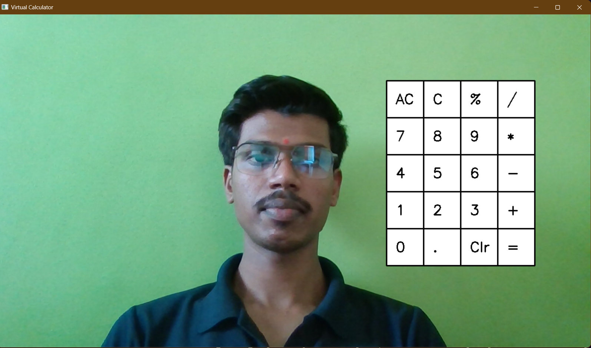
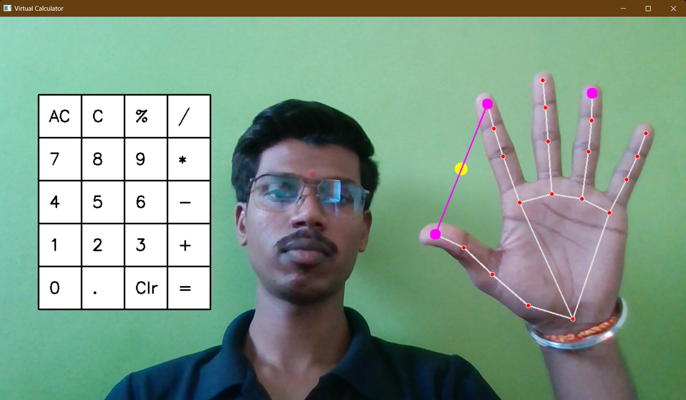

# Virtual Calculator using Computer vision
>This Virtual Calculator is a Computer Vision-based project built using OpenCV and MediaPipe. It enables users to perform basic arithmetic operations using hand gestures, eliminating the need for physical keypads. The calculator detects fingers and interprets them as numbers or operations, making it an interactive and innovative way to calculate.

## Table of contents
* [Demo](#demo)
* [Screenshots](#screenshots)
* [Technologies and Tools](#technologies-and-tools)
* [Setup](#setup)
* [Process](#process)
* [Features](#features)

## Demo

## Screenshots

## Technologies and Tools
* Python 
* OpenCV
* Mediapipe
* Numpy
* tkinter

## Setup

* The project dependencies are listed in the requirements.txt file. Install them using:
 
`pip install -r requirements.txt`

This will help you in installing all the libraries required for the project.

## Process

* Run the Virtual Calculator by executing virtual_calculator.py. This will open a webcam feed and display the calculator interface.
* Hand Detection using MediaPipe is used to track 21 hand landmarks, including fingertips and joints, to detect finger movements.
* Virtual Calculator Interface is created using OpenCV, where buttons are drawn on the screen with specific coordinates for numbers, operators, and functions.
* Detect Hand Gestures for interaction:
 	* Move your index finger over a button.
  	* Pinch (touch thumb & index finger) to press a button.
  	* The selected number/operator is added to the equation.
* Display and Evaluate Expression:
	* The pressed buttons form a mathematical expression, displayed on the screen.
  	* Pressing "=" evaluates the expression using Python's eval() function, and the result is displayed.
* Clear or Restart Calculation: Pressing "C" clears the current input, allowing new calculations.
* Run `virtual_calculator.py`. This will open up the calculator window which will use your webcam to perform arithmatic operations.
* Close the Application: Press "q" to exit, which stops the webcam and closes all OpenCV windows.  

## Features

